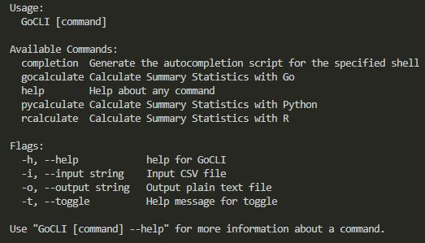

<h2 align="center">
Command Line Interface Comparison
</h2>

<h4 align="center">
Summary Statistics and Execution Time
</h4>

<h3 align="center">
Go / Python / R
</h3>

This application performs three main tasks:
1. reads an input file ("housesInput.csv")
2. calculates summary statistics
3. writes summary statistics to a .txt output file

These tasks may be completed with either Go, Python, or R.

Regardless of the language chosen, the application will repeat tasks 1-3 one hundred times. The output will provide the total runtime for all iterations, as well as the average time for an individual run. Summary statistics from each language may vary, but all include at least the maximum, minimum, and mean for each variable.

When running the execution file, GoCLI.exe, you will be presented with the following menu:




To utilize the application's function, write a command with the format:
```
    ./GoCLI <command_name> -i <input_filename.csv> -o <output_filename.txt>
```

- Where command_name is replaced with one of the available commands: gocalculate, pycalculate, or rcalculate
- input_filename.csv is replaced with the input filename: "housesInput.csv"
- output_filename.txt is replaced with a unique output filename as described below

|   Command   |     Output Name    |
|-------------|--------------------|
| gocalculate | housesOutput.txt   |
| pycalculate | housesOutputPy.txt |
| rcalculate  | housesOutputR.txt  |


<h3 align="center">
Results
</h3>

After running the application on my own system, I received the following total runtimes (for all 100 runs):

| Language | Runtime (sec) |
|----------|---------------|
| Go       | 1.01          |
| Python   | 2.22          |
| R        | 5.27          |

You can clearly see that Go has the best execution time from this experiment. From these runs, Go is more than twice as fast as Python and more than five times as fast as R!

The output files from this application have been added to this repo so you can see for yourselves the results of each language's calculations. I will include some comparison tables below for ease of access.

### Maximum
| Variable | Go     | Python | R      |
|----------|--------|--------|--------|
| Value    | 500001 | 500001 | 500001 |
| Income   | 15     | 15     | 15     |
| Age      | 52     | 52     | 52     |
| Rooms    | 39320  | 39320  | 39320  |
| Bedrooms | 6445   | 6445   | 6445   |
| Pop      | 35682  | 35682  | 35682  |
| HH       | 6082   | 6082   | 6082   |

### Minimum
| Variable | Go     | Python | R      |
|----------|--------|--------|--------|
| Value    | 14999  | 14999  | 14999  |
| Income   | 0.4999 | 0.4999 | 0.4999 |
| Age      | 1      | 1      | 1      |
| Rooms    | 2      | 2      | 2      |
| Bedrooms | 1      | 1      | 1      |
| Pop      | 3      | 3      | 3      |
| HH       | 1      | 1      | 1      |


### Mean
| Variable | Go     | Python | R      |
|----------|--------|--------|--------|
| Value    | 206856 | 206856 | 206856 |
| Income   | 3.87   | 3.87   | 3.87   |
| Age      | 28.64  | 28.64  | 28.64  |
| Rooms    | 2636   | 2636   | 2636   |
| Bedrooms | 537.9  | 537.9  | 537.9  |
| Pop      | 1425   | 1425   | 1425   |
| HH       | 499.5  | 499.5  | 499.5  |

As you can see, all calculations are identical to each other. This shows that Go's fast runtimes do not have a negative impact on it's accuracy.